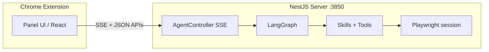

# Browser Test Agent

> **中文文档** → [README.zh-CN.md](./README.zh-CN.md)

A **Chrome extension + NestJS backend** that turns natural language into **structured page testing**, **SEO checks**, **PageSpeed-style performance signals**, and **Playwright-driven automation**—orchestrated by **LangGraph** with streaming updates to the panel UI.

---

## Highlights

| Area | What stands out |
|------|-----------------|
| **Multi-agent graph** | LangGraph `StateGraph`: main dialog → planner → dispatcher → parse HTML / parallel workers / report → summary. Clear task states (`pending` → `running` → `done` / `failed`). |
| **Parallel execution** | `testCodeAgent`, `seoAgent`, and `pagespeedAgent` run in a **single parallel batch** when dependencies allow; results merge back into one `taskPlan`. |
| **Playwright + CDP** | Optional **server-side Chromium** captures HTML and keeps a **session id** so generated tests run on the **same tab** as the capture flow. |
| **Skill layer** | Reusable **skills** (get HTML, compress, cache, report, run test code) sit above core tools; stream events include `skill_*` for observability. |
| **Rich streaming** | SSE from `POST /api/agent/run`; events cover agents, skills, tools, MCP-style PageSpeed calls, markdown `text`, and final `complete` with reports. |
| **Extension UX** | React 19 + assistant-ui patterns: thread, tool/skill cards, artifacts, **re-run test code** modal calling `POST /api/agent/run-test-code`. |
| **Caching** | File-backed cache under `.agent-cache/` (HTML snapshots, DSL, test code, reports) to skip redundant work and speed reruns. |

---

## Architecture



- **Extension** (`packages/extension`): MV3, talks to `http://localhost:3850` (see `host_permissions` in `manifest.json`). `VITE_AGENT_API` overrides the API base (`agent-api-base.ts`).
- **Server** (`packages/server`): NestJS app, LangGraph compiled graph, OpenAI-compatible LLM (default DeepSeek), Playwright, file cache.

---

## Repository layout

```
browserTestAgent/
├── package.json                 # pnpm workspace root scripts
├── pnpm-workspace.yaml
├── packages/
│   ├── extension/               # Vite + React Chrome extension
│   │   ├── manifest.json
│   │   └── src/panel/           # Sidebar UI, agent runtime, modals
│   └── server/                  # NestJS + LangGraph
│       ├── src/
│       │   ├── agents/          # graph, state, per-agent nodes, prompts
│       │   ├── gateway/         # HTTP + SSE endpoints
│       │   ├── skills/          # Skill registry + run-skill pipeline
│       │   ├── tools/           # read / write / playwright
│       │   ├── lib/             # file-cache, playwright session, reports
│       │   └── mcps/            # PageSpeed Insights helper (API key optional)
│       └── .agent-cache/        # Runtime artifacts (gitignored)
```

---

## Core concepts

1. **State (`BrowserTestState`)** — Messages, `userInput`, `pageUrl`, `pageHtml`, Playwright flags, `taskPlan`, `pageDSL`, `agentOutputs`, `streamEvents`, `reports`.
2. **Planner** — Breaks work into typed tasks (`parseHtml`, `testCode`, `seo`, `pagespeed`, `report`) with dependencies and `canParallel`.
3. **Dispatcher** — Schedules parse-first (needs HTML → DSL), then parallel specialists when `pageDSL` exists, then report.
4. **Tools** — `read` / `write` (sandboxed paths) and `playwright` (`capture`, `refresh_outer_html`, `run_test`).
5. **Skills** — Higher-level steps registered in `registry.ts`, invoked with streaming telemetry for the UI.

---

## HTTP API (server)

| Method & path | Purpose |
|---------------|---------|
| `POST /api/agent/run` | Main run: body `{ userInput, pageUrl, usePlaywright?, headless?, slowMoMs? }`. **SSE** stream of JSON events. |
| `POST /api/agent/run-test-code` | Re-execute Playwright test snippet: `{ sessionId?, code, targetUrl?, timeoutMs? }`. JSON result. |

Default port: **3850** (`PORT` env overrides).

---

## Configuration

Place a `.env` near the server or repo root (see `load-env.ts` upward search).

| Variable | Role |
|----------|------|
| `LLM_API_KEY` / `DEEPSEEK_API_KEY` / `OPENAI_API_KEY` | Chat model API key (priority left to right with fallbacks in `llm-client.ts`) |
| `LLM_BASE_URL` / `LLM_MODEL` | Override OpenAI-compatible endpoint and model |
| `PAGESPEED_API_KEY` / `GOOGLE_PSI_API_KEY` | Real PageSpeed Insights API; if empty, a **stub** score path is used |
| `PORT` | HTTP port (default `3850`) |

---

## Development

```bash
pnpm install
# Server: install Chromium for Playwright once
pnpm --filter @browser-test-agent/server run playwright:install

# Terminal 1
pnpm run dev:server

# Terminal 2 — extension watch build
pnpm run dev:extension
# Optional: panel as web dev server
pnpm run dev:web
```

Load the extension from `packages/extension/dist` (or your Vite output path) in `chrome://extensions` → **Load unpacked**.

---

## Build

```bash
pnpm run build
```

Produces server `dist/` and extension bundled assets for production.

---

## Tech stack (summary)

- **Workspace**: pnpm monorepo  
- **Server**: NestJS 11, LangChain / LangGraph, Playwright, TypeScript  
- **Extension**: React 19, Vite 6, Zustand, assistant-ui, MV3  

---

## License & notes

This repository is marked **private** in `package.json`. Ensure API keys and `.agent-cache/` stay out of version control (see `.gitignore`). PageSpeed behavior without an API key is **placeholder data** for local development only.
