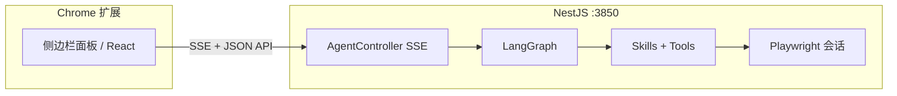

# Browser Test Agent（浏览器测试代理）

> **English** → [README.md](./README.md)

**Chrome 扩展 + NestJS 后端**：用自然语言驱动 **结构化页面测试**、**SEO 检查**、**类 PageSpeed 性能信号**，以及 **Playwright 自动化**；编排层为 **LangGraph**，通过 **SSE** 将代理、技能、工具执行过程流式推到扩展面板。

**扩展文档：** [产品与架构总览](./docs/product-architecture-overview.zh-CN.md) · [压缩 HTML 与 PageDSL 生成设计](./docs/parse-html-dsl-design.md)

---

## 亮点速览

| 维度 | 说明 |
|------|------|
| **多代理图** | 基于 LangGraph `StateGraph`：主对话 → 规划 → 调度 → HTML 解析 / 并行子任务 / 报告 → 收尾。任务状态清晰：`pending` → `running` → `done` / `failed`。 |
| **任务计划** | `taskPlan` 为 **主任务列表**（`TaskPlanMain`），每项含 **`subTasks` 串行子任务**（解析 → 执行 → 报告）；调度器按全局依赖顺序逐步执行。 |
| **Playwright + CDP** | 可选 **服务端 Chromium** 抓取 HTML，并维护 **sessionId**，使生成测试与抓取流程 **共用同一页签**，贴近真实用户场景。 |
| **技能层（Skills）** | 在 `read` / `write` / `playwright` 等 **工具** 之上封装可复用 **技能**（拉取 HTML、压缩、缓存、报告、执行测试代码等），流式事件含 `skill_*`，便于 UI 观测。 |
| **流式体验** | `POST /api/agent/run` 使用 **SSE**；事件覆盖代理起止、技能、工具、类 MCP 的 PageSpeed 调用、Markdown `text`、以及带 `reports` 的 `complete`。 |
| **扩展端 UX** | React 19 + assistant-ui 思路：对话线程、工具/技能卡片、产物面板；支持 **RunTestCodeModal** 通过 `POST /api/agent/run-test-code` 单独重跑测试代码。 |
| **文件缓存** | `.agent-cache/` 下持久化 HTML 快照、DSL、测试代码、报告等，减少重复抓取与重复推理，加快二次运行。 |
| **聊天持久化** | MongoDB（Mongoose）存储会话、用户/助手轮次与 SSE 事件；`GET /api/agent/chat/*` 供扩展拉取历史与 hydration。 |

---

## 架构示意



- **扩展**（`packages/extension`）：Manifest V3，默认请求 `http://localhost:3850`（见 `manifest.json` 的 `host_permissions`）。可通过环境变量 **`VITE_AGENT_API`** 覆盖 API 根地址（`agent-api-base.ts`）。
- **服务端**（`packages/server`）：Nest 应用内嵌编译后的 LangGraph；LLM 走 **OpenAI 兼容协议**（默认 DeepSeek）；Playwright 负责浏览器与测试执行；文件缓存落盘；MongoDB 承载聊天与会话事件。

---

## 仓库结构

```
browserTestAgent/
├── package.json                 # 根脚本：dev:server / dev:extension / build
├── pnpm-workspace.yaml
├── docs/                        # 设计说明（产品架构、HTML→DSL 等）
├── packages/
│   ├── extension/               # Vite + React 浏览器扩展
│   │   ├── manifest.json
│   │   └── src/panel/           # 侧边栏、agent 运行时、弹窗与组件
│   └── server/                  # NestJS + LangGraph
│       ├── src/
│       │   ├── agents/          # 状态机图、状态定义、各 Agent 节点与提示词
│       │   ├── gateway/         # HTTP + SSE 控制器
│       │   ├── chat/            # Mongoose 模型与聊天持久化
│       │   ├── skills/          # 技能注册表与执行管线
│       │   ├── tools/           # read / write / playwright
│       │   ├── lib/             # 缓存、Playwright 会话、报告生成等
│       │   └── mcps/            # PageSpeed Insights 轻量封装（API Key 可选）
│       └── .agent-cache/        # 运行产物（已由 .gitignore 忽略）
```

---

## 核心概念

1. **状态 `BrowserTestState`**：消息、`userInput`、`pageUrl`、`pageHtml`、Playwright 开关、**`taskPlan`（`TaskPlanMain[]`，含 `subTasks`）**、`pageDSL`、各代理输出、`streamEvents`、`reports`。
2. **规划器（planAgent）**：把需求拆成带依赖与 `canParallel` 的任务类型：`parseHtml` / `testCode` / `seo` / `pagespeed` / `report`。
3. **调度器（dispatcher）**：优先解析 HTML 得到 DSL；再并行跑测试/SEO/PageSpeed；最后汇总报告类任务。
4. **工具（Tools）**：`read` / `write`（路径受控）与 `playwright`（`capture`、`refresh_outer_html`、`run_test`）。
5. **技能（Skills）**：在 `registry.ts` 注册，由 `run-skill` 等逻辑调用，并向流中写入细粒度事件。

---

## HTTP 接口（服务端）

| 方法与路径 | 作用 |
|------------|------|
| `POST /api/agent/run` | 主流程：请求体含 `userInput`、`pageUrl`，以及可选的 `usePlaywright`、`headless`、`slowMoMs`。响应为 **SSE**，每行 `data: {JSON}`。 |
| `POST /api/agent/run-test-code` | 扩展侧「重新执行」测试代码：请求体含 `code`，可选 `sessionId`、`targetUrl`、`timeoutMs`。返回 JSON。 |
| `GET /api/agent/report-html?path=…` | 读取 `.agent-cache` 下已生成的报告 HTML（仅允许 `reports/` 前缀，防路径穿越）。 |
| `GET /api/agent/chat/sessions` | 列出聊天会话（MongoDB）。 |
| `GET /api/agent/chat/messages?sessionId=&limit=` | 按会话拉取历史消息（省略 `sessionId` 时用服务端默认会话）。 |
| `GET /api/agent/chat/sessions/:sessionId/messages` | 按路径参数拉取某会话消息列表。 |

默认监听端口：**3850**（可用环境变量 `PORT` 修改）。

---

## 环境变量

将 `.env` 放在服务端工作目录或仓库根目录附近（见 `load-env.ts` 的向上查找逻辑）。

| 变量 | 用途 |
|------|------|
| `LLM_API_KEY` / `DEEPSEEK_API_KEY` / `OPENAI_API_KEY` 等 | 大模型密钥（具体优先级见 `llm-client.ts`） |
| `LLM_BASE_URL` / `LLM_MODEL` | 覆盖 OpenAI 兼容 Base URL 与模型名 |
| `PAGESPEED_API_KEY` / `GOOGLE_PSI_API_KEY` | 真实 PageSpeed Insights；未配置时使用 **占位 stub**，仅便于本地联调 |
| `MONGODB_URI` | MongoDB 连接串（聊天持久化；默认 `mongodb://127.0.0.1:27017/browser-test-agent`） |
| `PORT` | HTTP 端口 |
| `PARSE_HTML_LLM_MAX_CHUNK_CHARS` | （可选）PageDSL 解析时每段压缩 HTML 最大字符数，见 [parse-html-dsl-design.md](./docs/parse-html-dsl-design.md) |
| `PLAYWRIGHT_CDP_URL` / `CHROME_CDP_URL` | （可选）挂接本机已开启远程调试的 Chrome，例如 `http://127.0.0.1:9222`；设置后 capture / run_test 优先使用 URL 匹配的现有页签，且 **不会** 在会话结束时关闭你的浏览器 |

**挂接已有 Chrome（可选）**

```bash
# 启动带 9222 的 Chrome（默认复用日常配置；若 Chrome 在跑会先退出再重启，通常恢复标签与登录态）
pnpm chrome:cdp

# .env
PLAYWRIGHT_CDP_URL=http://127.0.0.1:9222
```

重启后 Chrome 一般会恢复原有标签；再跑 Agent 即可挂接对应页签。空配置调试：`CHROME_ISOLATED_PROFILE=1 pnpm chrome:cdp`。

---

## 本地开发

```bash
pnpm install
# 为 Playwright 安装 Chromium（仅需一次）
pnpm --filter @browser-test-agent/server run playwright:install
# 聊天持久化：需可访问的 MongoDB（默认 mongodb://127.0.0.1:27017/browser-test-agent，可用 MONGODB_URI 覆盖）

# 终端 1：后端
pnpm run dev:server

# 终端 2：扩展 watch 构建
pnpm run dev:extension
# 可选：仅调试面板 UI
pnpm run dev:web
```

在 Chrome 打开 `chrome://extensions` → **加载已解压的扩展程序**，选择 `packages/extension/dist`（或当前 Vite 输出目录）。

---

## 构建

```bash
pnpm run build
```

会构建服务端 `dist/` 与扩展产物，便于打包或发布。

---

## 技术栈摘要

- **Monorepo**：pnpm workspace  
- **服务端**：NestJS 11、LangChain / LangGraph、Playwright、TypeScript  
- **扩展**：React 19、Vite 6、Zustand、assistant-ui、Chrome MV3  

---

## 说明

仓库在 `package.json` 中标记为 **private**。请勿将 API 密钥与 `.agent-cache/` 提交到 Git（参见根目录 `.gitignore`）。未配置 PageSpeed API Key 时，性能相关数据为 **占位实现**，不能作为线上性能依据。服务端会将**聊天与 SSE 事件**写入 **MongoDB**，开发环境建议使用独立库实例。

更多英文说明见同仓库 **[README.md](./README.md)**。
