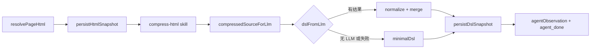

# 压缩 HTML 与 PageDSL 生成方案设计

本文说明 `parseHtmlAgent`（`packages/server/src/agents/parse-html-agent.ts`）如何获取页面 HTML、压缩后交给 LLM，以及如何产出与合并 **PageDSL**。提示词规范见 `packages/server/src/agents/prompts/parse-html-agent.prompt.ts`。

## 目标与产出

- **输入**：当前任务的 `pageUrl`、可选的 Playwright 会话与 HTML 快照缓存。
- **中间表示**：经 `compress-html` 技能处理后的压缩 HTML（优先作为 LLM 输入；若压缩结果为空则回退到原始 HTML）。
- **输出**：符合 `state.ts` 中 `PageDSL` 类型的结构化描述（`url`、`title`、`elements`、`forms`、`landmarks`），并可选写入 DSL 快照缓存。

PageDSL 用于概括页面上可测的交互与语义节点（按钮、链接、输入、表单、地标等），便于后续测试或分析 Agent 使用。

## 整体流水线

1. **解析 HTML**：从文件缓存读取快照；若启用 Playwright 且存在 `runnerSessionId`，则通过 `get-html` 技能在 CDP 阶段刷新后再用返回的 `pageHtml`。
2. **持久化原始快照**：`cache-file`（`kind: 'html_snapshot'`）便于后续任务复用。
3. **压缩**：`runSkill('compress-html', { html })`。
4. **选源**：若技能返回的 `compressedHtml` 非空则用之，否则用原始 `pageHtml`。
5. **LLM 解析**：在已配置聊天 LLM 的前提下，按长度选择「单次全量」或「多分片 + 增量合并」；否则或解析失败时使用 **minimalDsl**（仅从原始 HTML 用正则取 `<title>`，其余为空结构）。
6. **持久化 DSL**：`cache-file`（`kind: 'dsl_snapshot'`），缓存键来自任务 `cacheKey` 或生成的 `parse_dsl_...` 默认键。

## HTML 来源与刷新策略

| 条件 | 行为 |
|------|------|
| 默认 | `fileCacheService.readHtmlSnapshotByPageUrl(pageUrl)` |
| `runnerSessionId` 非空且 `usePlaywrightBrowser` | 额外调用 `get-html`（`phase: 'cdp_refresh'`），成功且返回非空 `pageHtml` 则覆盖 |

这样静态快照与「当前浏览器里真实 DOM」可以兼顾：有会话时优先刷新，避免过期 HTML。

## 压缩阶段（compress-html）

实现位于 `packages/server/src/skills/compress-html.skill.ts`，底层为 `packages/server/src/lib/html-compressor.ts`。

- **移除**：`<script>`、`<style>`、HTML 注释。
- **属性裁剪**：仅保留对定位与语义有用的属性：`id`、`class`、`data-testid`、`role`、`type`、`name`、`placeholder`、`href`；其余 `name="..."` 形式的双引号属性会被去掉。
- **长度上限**：技能默认 `maxLength: 800_000`（可在调用时通过 `compressOptions` 覆盖）。

压缩为**纯本地**字符串变换，不调用外部模型，目的是在保留可测信息的前提下显著缩小 token。

## LLM 输入长度与分片

### 环境变量

- **`PARSE_HTML_LLM_MAX_CHUNK_CHARS`**（可选）：单段送给 LLM 的压缩 HTML **最大字符数**。
- 未设置或非法（小于 4000）时，使用默认值 **28_000**（注释中说明为适配 DeepSeek 类等约 64k 上下文窗口，为 system + 输出预留空间）。
- 合法上限封顶 **200_000**。

### 单次 vs 分片

- `sourceForLlm.length <= maxChunk`：**单次**调用 `dslFromLlmSingle`（system + user 含整段压缩 HTML），期望模型输出**完整** `PageDSL` JSON。
- 超过 `maxChunk`：**分片**调用 `dslFromLlmChunked`。

### 分片切分算法（`splitCompressedHtmlIntoChunks`）

- 按 `maxChunkChars` 滑动切分。
- **边界对齐**：每段末尾尽量落在最近的 `>` 之后（在窗口内从末尾向前找 `>`），减少标签被拦腰截断；若找不到合理位置则仍按字符上限切。
- 每段携带元数据：`index`、`total`、`charStart`、`charEnd`，并包在 XML 风格标记中：

  `<PARSE_HTML_CHUNK index="..." total="..." totalChars="..." charStart="..." charEnd="...">...</PARSE_HTML_CHUNK>`

### 分片下的两次提示策略

| 轮次 | System 提示 | 模型输出形状 |
|------|----------------|--------------|
| 第 1 段 | `PARSE_HTML_DSL_SYSTEM_PROMPT` + `PARSE_HTML_DSL_MULTI_FIRST_APPEND` | 完整 **PageDSL**（仅依据本段可见 DOM，不要求猜测未出现内容） |
| 第 2 段起 | `PARSE_HTML_DSL_CONTINUATION_SYSTEM_PROMPT` | **仅** `elements`、`forms`、`landmarks` 的增量 JSON（不得含 `url`/`title`） |

延续轮的用户消息中会附带 **已占用的 element / form id 摘要**（`summarizeExistingIdsForPrompt`：最多列出前 220 个 element id、前 80 个 form id，并标注总数与是否截断），要求新 id 不与已有重复；规范建议使用 `chunk-{片段序号}-{描述}` 等形式保证唯一。

### 合并与容错（`mergePageDslFragments`）

- **elements / forms**：按 `id` 去重追加，仅接受非空字符串 `id`。
- **landmarks**：对象浅合并（后续片段可覆盖或补充键）。
- 任一段 **JSON 解析失败**：该段跳过，保留此前已合并结果；第一段失败则整次 chunked 解析返回 `dsl: null`，最终回退 `minimalDsl`。

单次解析失败同样返回 `null` 并回退。

## 无 LLM 时的行为

`hasChatLlm()` 为 false 时跳过所有 `dslFromLlm*` 调用，直接使用 `minimalDsl`。观测文案中会区分「超长可分片但未配置 LLM」与「已分片调用」等情况（见 `agentObservation` 的 `summary` 与 `data.chunked` / `htmlLlmSegments` / `llmChunks` / `llmParse`）。

## 观测与调试字段

`agentObservation` 的 `data` 中常见字段含义：

| 字段 | 含义 |
|------|------|
| `compressedHtmlLength` | 实际送入解析链路的字符串长度（压缩优先） |
| `maxChunkChars` | 当前生效的单段 LLM 输入上限 |
| `chunked` | 是否因长度需要多分片（仅按 HTML 长度与阈值判断） |
| `htmlLlmSegments` | 若参与 LLM，会切成几段 HTML |
| `llmChunks` | 实际发起的 LLM 请求次数（无 LLM 时为 0） |
| `llmParse` | 是否成功得到 LLM 解析结果（非回退 minimal） |
| `dslCacheKey` / `dslSnapshotRelativePath` | DSL 缓存键与快照相对路径 |

## 相关文件索引

| 路径 | 职责 |
|------|------|
| `packages/server/src/agents/parse-html-agent.ts` | 编排：取 HTML、压缩、分片、调用 LLM、合并、缓存、事件 |
| `packages/server/src/agents/prompts/parse-html-agent.prompt.ts` | PageDSL 与分片约定的 system/user 文案 |
| `packages/server/src/skills/compress-html.skill.ts` | 压缩技能入口与默认选项 |
| `packages/server/src/lib/html-compressor.ts` | 压缩算法实现 |
| `packages/server/src/agents/state.ts` | `PageDSL` 类型定义 |

## 设计取舍小结

1. **先规则压缩、再 LLM 结构化**：降低噪声与 token，把「理解页面」交给模型。
2. **超长 HTML 分段 + 第一段全量后续增量**：在固定上下文窗口下覆盖整页，同时用 id 列表抑制重复命名。
3. **分段失败可降级**：单段失败不拖垮已解析部分；全无 LLM 时仍有可运行的最小 DSL。
4. **缓存分层**：HTML 快照与 DSL 快照分离，便于复现与跳过重复解析（取决于上层任务计划与缓存键）。
