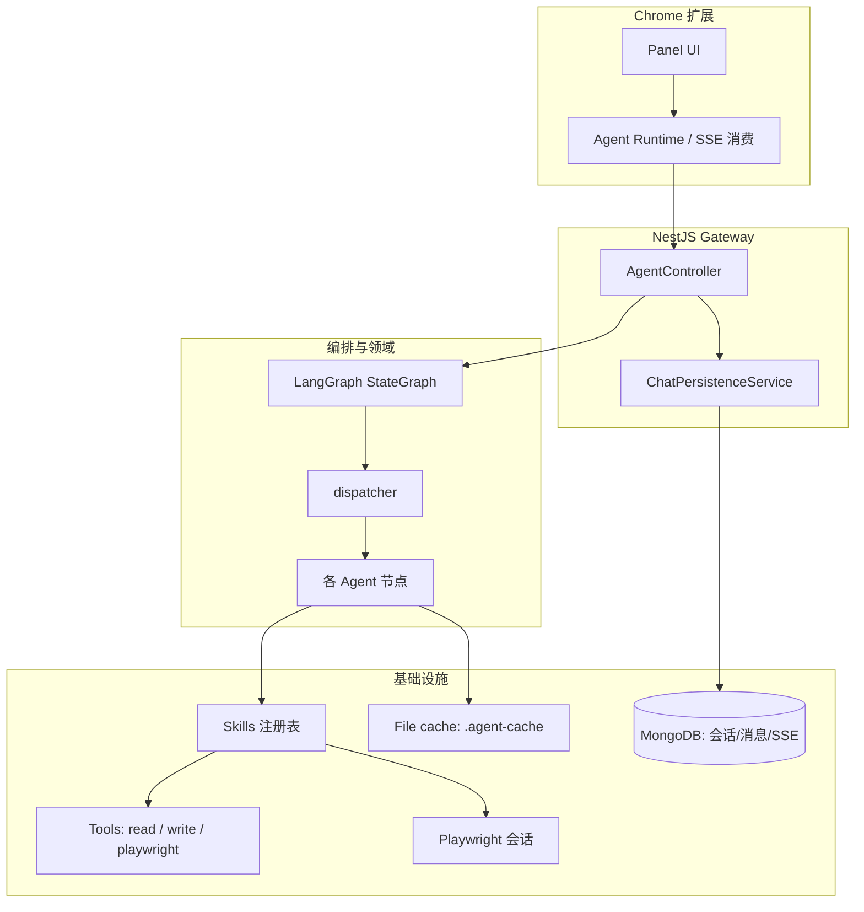
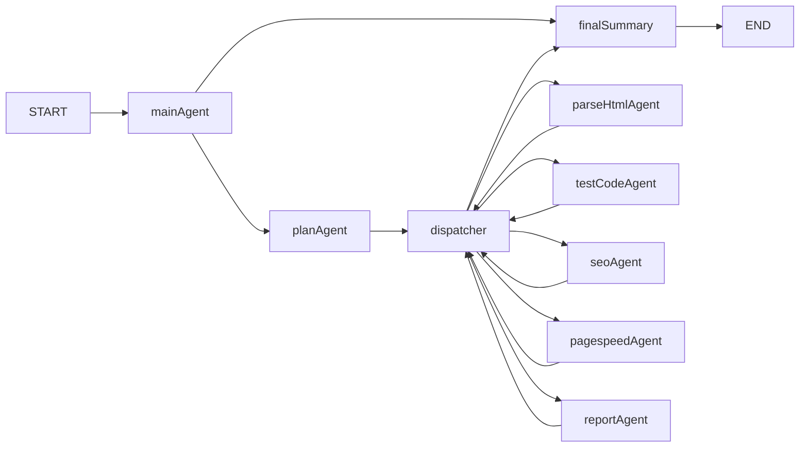

# Browser Test Agent：产品功能、架构与优化亮点

本文从**产品能力**、**系统架构**与**工程优化**三方面概括本仓库（Chrome 扩展 + NestJS 后端），并与 [README.zh-CN.md](../README.zh-CN.md) 及专项设计文档互补。

---

## 1. 产品定位与价值

**Browser Test Agent** 面向需要在真实浏览器上下文中完成「理解页面 → 分析/生成 → 执行验证」的团队与个人：用户用自然语言描述目标，系统在受控流程下产出 **页面结构 DSL（PageDSL）**、**可运行的 Playwright 测试思路/代码**、**SEO 与性能类检查**，并以 **流式事件** 在扩展侧展示全过程。

核心价值：

- **端到端闭环**：从当前页 URL 出发，经可选的 **服务端 Playwright + CDP** 抓取 HTML，到多专家代理并行产出，再到 HTML 报告与产物面板。
- **可观测**：SSE 推送代理起止、技能、工具、文本片段与最终 `complete`，便于调试与产品化展示。
- **可复跑**：同一会话内可单独 **重跑测试代码**；磁盘缓存减少重复抓取与重复推理。

---

## 2. 产品功能矩阵

| 能力域 | 说明 | 主要载体 |
|--------|------|-----------|
| **自然语言驱动** | 用户输入意图与约束，由主代理对话并触发规划 | `mainAgent` → `planAgent` |
| **任务规划** | 将需求拆为带依赖的子任务（解析 HTML、测试代码、SEO、PageSpeed、报告等），支持并行标记 | `taskPlan` / `TaskPlanMain` + `subTasks` |
| **页面结构解析** | 压缩 HTML 后由 LLM 抽取 **PageDSL**（元素、表单、地标）；超长时分片合并 | `parseHtmlAgent` + `compress-html` 技能；详见 [parse-html-dsl-design.md](./parse-html-dsl-design.md) |
| **测试代码生成与执行** | 基于 DSL/上下文生成 Playwright 片段；支持扩展内 **RunTestCode** 单独调用接口重跑 | `testCodeAgent`、`POST /api/agent/run-test-code` |
| **SEO 检查** | 专项代理产出 SEO 相关结论（与页面内容/元信息结合） | `seoAgent` |
| **性能信号（PageSpeed）** | 集成类 PageSpeed / PSI 能力；无 API Key 时为本地占位数据 | `pagespeedAgent`、`mcps/` |
| **报告汇总** | 多源结果汇总为可读报告（含 HTML 等产物路径） | `reportAgent`、报告缓存 |
| **扩展侧体验** | 侧边栏：对话线程、工具/技能卡片、运行产物、报告预览 | `packages/extension`（React 19 + assistant-ui 思路） |
| **会话与历史（服务端）** | MongoDB 持久化会话、用户/助手轮次，以及 SSE 事件流片段，支持扩展拉取历史与 hydration | `ChatModule`、`GET /api/agent/chat/*` |

典型使用路径：**配置 LLM 与可选 PageSpeed Key** → 启动服务端与扩展 → 在目标站点打开侧边栏 → 输入任务并启用 Playwright → 观察流式卡片与最终报告 → 按需重跑测试代码。

---

## 3. 架构设计

### 3.1 逻辑分层

- **扩展层**：负责展示、发起 `POST /api/agent/run`（SSE）、`POST /api/agent/run-test-code`、拉取报告 HTML、聊天历史等。
- **网关层**：Nest 控制器设置 SSE 头、校验 `pageUrl`、串联 **图执行** 与 **聊天持久化**（用户轮次记录、流式事件追加、助手轮次汇总）。
- **编排层**：LangGraph 管理 `BrowserTestState`（消息、`taskPlan`、`pageDSL`、`agentOutputs`、`streamEvents`、`reports` 等）与节点跳转。
- **技能与工具层**：技能是对外稳定的业务步骤（拉 HTML、压缩、缓存、跑测试、写报告）；工具提供更底层能力并受路径/操作约束。
- **持久化**：运行期 HTML/DSL/测试代码/报告等走 **文件缓存**；会话维度走 **MongoDB**（会话、消息、SSE 事件）。

### 3.2 LangGraph 节点与数据流

要点（对应 `packages/server/src/agents/graph.ts`）：

1. **`mainAgent`**：对话与路由，可回到自身、进入 **`planAgent`** 或收尾 **`finalSummary`**。
2. **`planAgent`**：生成/更新 `taskPlan`（主任务与子任务、依赖、`canParallel`）。
3. **`dispatcher`**：在全局顺序下挑选下一个 **可执行且依赖已满足** 的子任务，发出 `agent_start`，并 `Command` 跳转到对应 Agent。
4. **专项 Agent**（`parseHtmlAgent`、`testCodeAgent`、`seoAgent`、`pagespeedAgent`、`reportAgent`）执行完毕后均回到 **`dispatcher`**，直至全部完成或无可执行任务。
5. **`finalSummary`**：发出 `complete`（含 `agentOutputs` 与 `reports`），并在使用 Playwright 时释放会话。

图使用 **MemorySaver** 作为 checkpointer，与 HTTP 层的 `thread_id` 配合，便于在异常路径下仍能尝试读取 `runnerSessionId` 并释放浏览器资源。

### 3.3 仓库物理结构（摘要）

| 路径 | 职责 |
|------|------|
| `packages/extension/` | MV3 扩展；Vite + React；面板、运行时、聊天 history API |
| `packages/server/src/agents/` | 状态定义、图、各 Agent、提示词、观测事件 |
| `packages/server/src/gateway/` | HTTP/SSE、报告 HTML 安全读取 |
| `packages/server/src/skills/` | 技能注册与执行管线 |
| `packages/server/src/tools/` | read / write / playwright |
| `packages/server/src/lib/` | 文件缓存、Playwright 会话、URL 校验、报告等 |
| `packages/server/src/chat/` | Mongoose 模型与聊天持久化服务 |
| `packages/server/src/mcps/` | PageSpeed 等外部能力封装 |
| `docs/` | 设计说明（如 HTML→DSL 分片策略） |

---

## 4. 优化与工程亮点

### 4.1 性能与成本

- **HTML 规则压缩后再送 LLM**：去 script/style/注释、裁剪属性，显著降低 token；技能默认 `maxLength` 防止极端页面撑爆内存。
- **超长压缩 HTML 的分片解析**：超过 `PARSE_HTML_LLM_MAX_CHUNK_CHARS`（默认 28k，可配置）时首段输出完整 PageDSL、后续段仅输出增量并合并，兼顾长页与上下文窗口；见 [parse-html-dsl-design.md](./parse-html-dsl-design.md)。
- **`.agent-cache/` 文件缓存**：HTML 快照、DSL、测试代码、报告等落盘，重复任务可减少 I/O 与模型调用。
- **SSE 流式输出**：首字节快、用户感知延迟低；事件粒度覆盖代理、技能、工具与文本。

### 4.2 可靠性与一致性

- **Playwright sessionId**：抓取与 `run_test` 可共用同一会话/页签，减少「环境不一致」导致的 flaky。
- **调度器按全局顺序选下一任务**：依赖关系与 `pending` → `running` → `done`/`failed` 状态清晰，避免竞态下乱序执行。
- **专项 Agent 统一 try/catch 包装**（如测试/SEO/PageSpeed）：单任务失败写入 `agent_failed` 与观测，不拖垮整图。
- **无效 pageUrl 或未启用 Playwright**：在控制器层快速返回友好提示与 `complete`，避免无效长耗时。

### 4.3 安全与运维

- **报告 HTML 读取**：仅允许 `reports/` 前缀且 `.html` 后缀，防止路径穿越。
- **read/write 工具**：沙箱化相对路径（与工具实现一致），降低任意文件读写风险。
- **密钥与缓存**：`.env` 与 `.agent-cache/` 不应入库；PageSpeed 无 Key 时明确为占位行为，避免误用于生产结论。

### 4.4 可扩展性

- **技能注册表**：新增 `SkillDefinition` 并在 `registry.ts` 注册即可扩展业务能力，且自带流式观测钩子。
- **OpenAI 兼容 LLM**：通过环境变量切换 base URL 与模型，便于对接多种供应商。
- **聊天与事件模型**：MongoDB 中会话、消息、SSE 事件分离建模，便于扩展多会话、审计与 UI hydration。

### 4.5 前端体验

- **工具/技能/观测卡片**：将后端 `streamEvents` 映射为结构化 UI，而非纯文本日志。
- **产物与报告**：与缓存路径、报告 HTML 接口联动，支持新标签页预览。

---

## 5. 相关文档与入口

| 文档 | 内容 |
|------|------|
| [README.zh-CN.md](../README.zh-CN.md) | 快速开始、环境变量、API 表、开发命令 |
| [README.md](../README.md) | 英文版同上 |
| [parse-html-dsl-design.md](./parse-html-dsl-design.md) | 压缩 HTML 与 PageDSL 分片 LLM 方案详解 |

---

## 6. 版本说明

架构与 API 会随迭代演进；若本文与代码不一致，以仓库内实现与 README 为准。更新本页时建议同步检查：`graph.ts`、`agent.controller.ts`、`state.ts`、`skills/registry.ts`。
